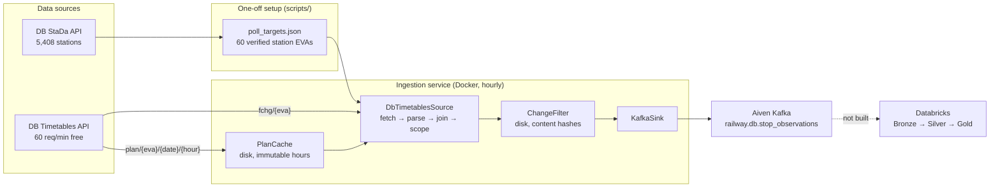
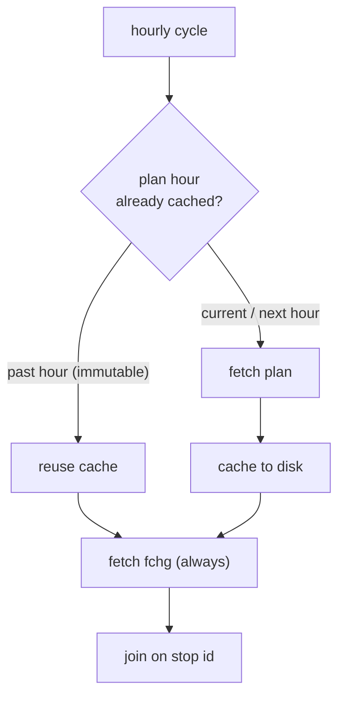
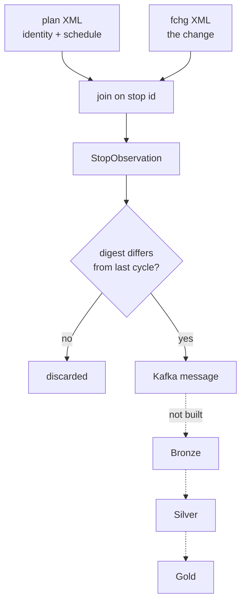

# railway-network-analytics

Collects German long-distance rail punctuality data from the Deutsche Bahn APIs and
streams it into Kafka, for later analysis of how delays develop across the network.

**Status: ingestion → Kafka works. Databricks and the Bronze/Silver/Gold layers are not built.**

---

## 1. What it does

Every hour, for ~60 major stations:

- pulls the **planned** timetable and the **current changes** from DB's Timetables API
- joins them, so each change carries its train's identity (`ICE 837`), planned times and route
- drops anything identical to the previous cycle
- publishes the rest to Kafka, one message per observed stop

The result is a durable, replayable log of *what changed, when* — delays, platform
changes, cancelled stops — keyed so a train's history can be reconstructed.

## 2. Architecture



## 3. Data sources

| | DB Timetables API | DB StaDa API |
|---|---|---|
| Gives | planned stops, changes, delays, platforms, delay causes | station master data: names, EVA numbers, coordinates, category |
| Format | XML | JSON |
| Role | **operational data** — changes constantly | **reference data** — changes ~monthly |
| Rate limit | **60 req/min** (free tier) | n/a in practice |
| Pulled | hourly, by the service | **once**, by hand, cached to disk |

Join key between them is the **EVA number**, never the station name: Timetables says
`Frankfurt(Main)Hbf`, StaDa says `Frankfurt (Main) Hbf`.

### Endpoints used

| Endpoint | What it returns | Why |
|---|---|---|
| `plan/{eva}/{date}/{hour}` | one station-hour of the **schedule** — `<tl>` train identity, planned times, platform, route | the only place train identity (`ICE 837`) exists |
| `fchg/{eva}` | **all** currently-known changes for a station, rolling ~28 h window | the change stream |
| `station/{name}` | name → EVA | one-off, during scope setup |

`rchg` (last ~2 min of changes) is **not** used: it is incompatible with hourly polling.

## 4. Polling strategy



| Data | Cadence | Why |
|---|---|---|
| StaDa stations | once, manual | reference data; refetching wastes budget |
| `poll_targets.json` | once, manual | derived from StaDa + probing |
| `plan` | ~2 requests/station/cycle | past hours are **immutable** → cached on disk |
| `fchg` | 1 request/station/cycle | always changing |

**Measured cost:** `60 stations × 3 requests = 180/cycle · 3.3 min · 3 req/min · 5 % of budget · 4,320 req/day of 86,400`.
A cold cache costs 18 plan requests per station; a warm one costs 2.

**Why hourly is enough:** `fchg` reports the current state of *every* stop of a train,
so one poll already shows a full delay profile along a route. Hourly gives up watching a
single estimate move minute-by-minute — that would need `rchg` at ~90 s, costing 68 % of
the budget instead of 5 %.

**Station scope is derived, not guessed.** StaDa's `category` measures station *size*, not
long-distance service — category 1 is only 23 stations and excludes Münster, Fulda,
Bielefeld, Göttingen and Bremen. `scripts/pick_poll_targets.py` instead reads the `ppth`
route paths of real trains to find which stations Fernverkehr actually serves, resolves
them to EVAs, and verifies each one answers.

## 5. Change detection

`fchg` returns a rolling 28 h window, so consecutive hourly polls overlap heavily.

| | |
|---|---|
| **Compared** | `changed_arrival`, `changed_departure`, `changed_platform`, `changed_path`, `messages` |
| **Ignored** | `observed_at` — our own timestamp changes every cycle and would defeat the filter |
| **Discarded** | observations whose comparison fields hash identically to last cycle |
| **Published** | everything else |
| **State** | `blake2b` digest per `stop_id` in `data/state/seen.json`, **replaced** each cycle |

State is persisted because an hourly run is cron-shaped and does not survive between
cycles. It is *replaced* rather than merged, so a stop that leaves the feed is forgotten
— which bounds the file, at the cost of re-emitting it once if it returns unchanged.

**Measured: 96–98 % suppressed** on back-to-back cycles. Real hourly suppression is lower
and has not yet been measured.

## 6. Kafka

| | Value | Why |
|---|---|---|
| Topic | `railway.db.stop_observations` | |
| Granularity | one message per observed stop | the source is station-centric; we poll 60 of ~5,400 stations, so a trip-shaped message would claim completeness we don't have |
| Key | `stop_id` = `{trip_id}-{start_datetime}-{stop_index}` | natural key; high cardinality → even partitions; keeps compaction possible later |
| Partitions | 2 | the Aiven plan's cap; ample at ~3 msg/s |
| Retention | **3 days** | 7 was requested and **refused**: `PolicyViolationError` — set in the Aiven console, not via Kafka |
| Cleanup | `delete` | `compact` keeps only the latest message per key, destroying the delay history |
| Compression | `gzip` | ~14× measured; only codec needing no extra dependency |
| Acks | `all` + idempotence | but `min.insync.replicas=1`, so today this is no stronger than `acks=1` |
| Delivery | at-least-once | downstream must be idempotent |

Observed balance across partitions: **1450 / 1375**. With only 6 distinct keys the split
was 5:1 — hashing gives determinism, cardinality gives balance.

## Data lineage

A real record collected on 2026-09-10: **ICE 837 at Frankfurt(Main)Hbf** — delayed,
moved platform, and dropped a stop.



**1 — `plan` XML** (the schedule; identity lives only here)

```xml
<s id="-6921696305208670614-2609100856-6">
  <tl f="F" t="p" o="80" c="ICE" n="837"/>
  <ar pt="2609101256" pp="11" fb="ICE 837"
      ppth="Berlin Gesundbrunnen|Berlin Hbf|Berlin Südkreuz|Halle(Saale)Hbf|Erfurt Hbf"/>
</s>
```

**2 — `fchg` XML** (the change; a sparse delta — note it carries no `<tl>`, so it cannot
identify the train on its own)

```xml
<s id="-6921696305208670614-2609100856-6" eva="8000105">
  <ar ct="2609101329" cp="12"
      cpth="Berlin Hbf|Berlin Südkreuz|Halle(Saale)Hbf|Erfurt Hbf"/>
  <m t="d" c="51"/>
  <m t="h" cat="Information"/>
</s>
```

**3 — `StopObservation`** (joined on the stop id; `observed_at` is ours, everything else
is the source's, unmodified)

```json
{
  "stop_id": "-6921696305208670614-2609100856-6",
  "station_eva": 8000105, "station_name": "Frankfurt(Main)Hbf",
  "trip_id": "-6921696305208670614", "start_datetime": "2609100856", "stop_index": 6,
  "train_category": "ICE", "train_number": "837",
  "train_operator": "80", "train_filter": "F",
  "planned_arrival": "2609101256", "changed_arrival": "2609101329",
  "planned_platform": "11",        "changed_platform": "12",
  "planned_path": "Berlin Gesundbrunnen|Berlin Hbf|Berlin Südkreuz|Halle(Saale)Hbf|Erfurt Hbf",
  "changed_path": "Berlin Hbf|Berlin Südkreuz|Halle(Saale)Hbf|Erfurt Hbf",
  "messages": [["d", "51", null], ["h", null, "Information"]],
  "observed_at": "2026-09-10T13:15:00+02:00"
}
```

Three facts are now visible that the raw XML only implied: **+33 min** (12:56 → 13:29),
**platform 11 → 12**, and **Berlin Gesundbrunnen dropped from the route**.

**4 — change detection** (hash the comparison fields only)

```
payload  ("2609101329", null, "12", "Berlin Hbf|...", [["d","51",null]])
digest   e0d91da45e9b7649

cycle N     e0d91da45e9b7649   first sight        → published
cycle N+1   e0d91da45e9b7649   identical          → discarded
cycle N+2   7ac5d0e493eae024   delay grew to +39m → published
```

**5 — Kafka message**

```
topic    railway.db.stop_observations
key      -6921696305208670614-2609100856-6
headers  schema_version=1
value    <the StopObservation JSON above>
```

**6 — Bronze / Silver / Gold** — *not built.* Planned shape:

| Layer | Would do |
|---|---|
| Bronze | append raw messages unchanged, preserving replayability |
| Silver | parse `YYMMDDHHMM` → timestamps, compute `delay = changed − planned`, deduplicate on `stop_id`, decode message codes (`d/51`), classify operator |
| Gold | delay by station, route punctuality, cancelled-stop rates, delay propagation |

## 7. Status

### Implemented and verified

- StaDa fetch + cache; station scope derived from real route data and probe-verified
- `plan` + `fchg` fetch, XML parse, join on stop id, disk-backed plan cache
- Scope filtering, change detection with persistent state
- JSONL sink and Kafka sink (`SINK=jsonl|kafka`)
- Dockerised, non-root, no secrets in the image; `SIGTERM` handled
- **77 offline tests**, ruff clean
- End-to-end verified: DB APIs → Docker → Aiven Kafka → consumer

### Planned next

- Measure real hourly suppression and daily volume over several hours
- Databricks connection, consuming from Kafka
- Bronze, then Silver, then Gold

### Future ideas

- Decode DB message codes into human-readable causes
- Widen station scope (budget allows ~4× more)
- Schema registry, if a second producer ever appears
- Backfill / replay tooling

---

## Running it

Requires [uv](https://docs.astral.sh/uv/), Python 3.14, and free DB API credentials from
[developers.deutschebahn.com](https://developers.deutschebahn.com).

```bash
uv sync && cp .env.example .env      # then fill in the credentials
```

One-off scope setup (~5 min of rate-limited requests):

```bash
set -a; source .env; set +a; uv run python scripts/fetch_stada.py && uv run python scripts/pick_poll_targets.py
```

One cycle to a local file:

```bash
set -a; source .env; set +a; MAX_POLLS=1 uv run python -m railway_network_analytics
```

One cycle to Kafka:

```bash
set -a; source .env; set +a; SINK=kafka MAX_POLLS=1 uv run python -m railway_network_analytics
```

Docker — `STATE_DIR` must be a volume, since the plan cache and change state must
survive between cycles:

```bash
docker build -t railway-ingest:0.2 . && docker run --rm -e TIMETABLES_CLIENT_ID -e TIMETABLES_API_KEY -e MAX_POLLS=1 -v rna-state:/app/data/state -v rna-out:/app/data/out railway-ingest:0.2
```

Tests:

```bash
uv run pytest ; uv run ruff check .
```

## Configuration

Environment variables, read once at startup and validated together. Invalid config exits
`2` listing every problem. Secrets are redacted from logs by field name.

| Variable | Default | |
|---|---|---|
| `TIMETABLES_CLIENT_ID` / `_API_KEY` | — | required; the key is **secret** |
| `STATION_DATA_CLIENT_ID` / `_API_KEY` | — | only for `scripts/fetch_stada.py` |
| `POLL_TARGETS_PATH` | `data/raw/stada/poll_targets.json` | must exist |
| `STATE_DIR` | `data/state` | plan cache + change state; **must persist** |
| `OUTPUT_DIR` | `data/out` | checked writable at startup |
| `POLL_INTERVAL_SECONDS` | `3600` | fixed-rate, not fixed-delay |
| `MAX_POLLS` | `0` | `0` = run until stopped |
| `SINK` | `jsonl` | or `kafka` |
| `KAFKA_*` | — | required only when `SINK=kafka` |
| `LOG_LEVEL` / `LOG_FORMAT` | `INFO` / `text` | `json` in the container |

Exit codes: `0` clean · `2` bad config · `3` poll targets missing/empty · `4` output not writable.

## Known limitations

**Data source**

- `f="F"` is a **DB-centric flag, not a mode classifier**. DB sets it only for its own and
  partner trains, so third-party operators have none — mixing private regional
  (`NX`, `ARV`, `vlx`) with open-access long-distance (`FLX`, `TRI`) in one unflagged
  bucket. Silver must classify on category + operator.
- ~14 % of changes never match a plan hour and stay unidentified. Kept deliberately: they
  skew towards trains that started long ago, i.e. the worst delays.
- The canonical EVA is not always the right one — Berlin Hbf's `8011160` returns 0 stops;
  its long-distance traffic is on `8098160`.
- Message codes (`d/51`, `cat="Störung"`) are undecoded.

**Pipeline**

- Retention is 3 days, so that is the whole replay window.
- `acks=all` is nominal while `min.insync.replicas=1`.
- `flush()` does not surface per-record failures, so the written count is slightly optimistic.
- At-least-once; no retry backoff (a missed cycle self-heals via `fchg`'s 28 h window).

## Repository layout

```
src/railway_network_analytics/
  config.py          env → validated Config; the only reader of os.environ
  db_timetables.py   source adapter: fetch, parse XML, join plan+changes, scope
  change_filter.py   persistent content-hash filter; source-agnostic
  sink.py            ObservationSink protocol + JSON Lines writer
  kafka_sink.py      same protocol, Kafka
  service.py         poll scheduling and failure policy
  logging_setup.py   text/JSON formatters
  __main__.py        entrypoint: config, logging, signals, wiring, exit codes
scripts/
  fetch_stada.py            one-off: cache station master data
  pick_poll_targets.py      one-off: derive + verify the station scope
  kafka_create_topic.py     create/configure the topic
  kafka_*.py                tutorial/diagnostic consumers and producers
  probe_timetables_join.py  diagnostic: inspect the plan/changes join
  profile_gtfs_rt.py        archived analysis of the retired GTFS.de source
tests/                      77 tests, offline, no credentials needed
data/                       source data, state, output — gitignored
```

## Attribution

Data from the Deutsche Bahn Timetables and StaDa APIs, © DB InfraGO AG.
