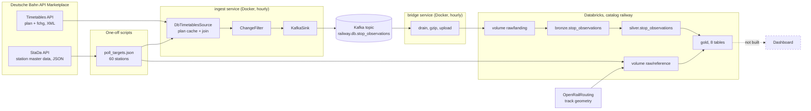

# railway-network-analytics

Hourly collection of German long-distance rail stop changes (delays, platform changes, cancellations) from the Deutsche Bahn Timetables API into Kafka, then into Databricks Delta tables (Bronze, Silver, Gold). Stack: Python 3.14, kafka-python, Databricks SDK, PySpark notebooks, Docker Compose.

## Status

**Built:** the ingestion service (DB APIs to Kafka), the bridge (Kafka to a Unity Catalog volume) and three Databricks notebooks (Bronze, Silver, Gold). The two Python services are covered by 103 offline tests. The notebooks have no automated tests; their comments record row counts from runs on collected data.

**Not in this repository:** published delay or punctuality results, a dashboard, a Databricks job definition. The real hourly suppression rate and the daily message volume have not been measured.

Last verified: 2026-09-30 (test suite and linter only; no live API, Kafka or Databricks call was re-run for this check).

```bash
uv sync
uv run pytest
```

## Key facts

| Fact | Value | Context and source |
|---|---|---|
| Stations polled | 60 | Default of `scripts/pick_poll_targets.py`, selected from 5,408 StaDa stations (snapshot fetched 2026-09-10). |
| API cost, warm cache | 180 requests per hourly cycle | Computed: 60 stations x (2 `plan` + 1 `fchg`). This is 5 % of the 60 requests/minute free plan. |
| API cost, cold cache | 1,140 requests, about 20 minutes | Computed: 60 x (18 `plan` + 1 `fchg`) at 1.1 s spacing (`db_timetables.py`). |
| Offline tests | 103 passing | `pytest` collection and run on 2026-09-30. |
| Compression | about 14x on Kafka batches, 11.8x on bridge files | Author's measurements recorded in code comments (commits of 2026-09-10 and 2026-09-15), not reproduced for this README. |
| Silver table size | 106,917 rows | Historical: recorded in a Silver notebook comment committed 2026-09-15, when the Gold notebook described the dataset as about 1 week of data. |

## Architecture


```mermaid
flowchart LR
  subgraph sources["Deutsche Bahn API Marketplace"]
    TT["Timetables API<br/>plan + fchg, XML"]
    SD["StaDa API<br/>station master data, JSON"]
  end

  subgraph setup["One-off scripts"]
    PT["poll_targets.json<br/>60 stations"]
  end

  subgraph ingest["ingest service (Docker, hourly)"]
    SRC["DbTimetablesSource<br/>plan cache + join"]
    CF["ChangeFilter"]
    KS["KafkaSink"]
  end

  K[("Kafka topic<br/>railway.db.stop_observations")]

  subgraph bridge["bridge service (Docker, hourly)"]
    BR["drain, gzip, upload"]
  end

  subgraph dbx["Databricks, catalog railway"]
    LAND["volume raw/landing"]
    BZ["bronze.stop_observations"]
    SV["silver.stop_observations"]
    GD["gold, 8 tables"]
    REF["volume raw/reference"]
  end

  ORR["OpenRailRouting<br/>track geometry"]
  DASH["Dashboard"]

  SD --> PT --> SRC
  TT --> SRC --> CF --> KS --> K --> BR --> LAND --> BZ --> SV --> GD
  PT --> REF
  ORR --> REF --> GD
  GD -.->|not built| DASH

  classDef planned stroke-dasharray: 5 5
  class DASH planned
```

## How it works

1. **Station scope (one-off).** `scripts/fetch_stada.py` caches station master data. `scripts/pick_poll_targets.py` reads the route paths of real long-distance trains, resolves the most frequent station names to EVA numbers and keeps those that answer with long-distance traffic.
2. **Poll and join.** For each station, [db_timetables.py](src/railway_network_analytics/db_timetables.py) fetches `fchg/{eva}` (all known changes, rolling window of about 28 hours) and joins it on the stop id to `plan/{eva}/{date}/{hour}`, the only endpoint that carries train identity. Plan hours from 9 hours back to 8 hours ahead are cached on disk; only the current and next hour are refetched.
3. **Scope filter.** Stops flagged as regional, S-Bahn or partner traffic are dropped. Stops with no flag are kept, including changes that matched no plan hour.
4. **Change filter.** [change_filter.py](src/railway_network_analytics/change_filter.py) hashes 10 change fields per stop (blake2b, 8 bytes) and emits only stops whose digest differs from the previous cycle. `observed_at` is excluded from the hash.
5. **Sink.** `SINK=kafka` publishes one message per stop observation (28 fields, JSON), keyed by `stop_id`, with a `schema_version=1` header. `SINK=jsonl` appends to `observations-YYYY-MM-DD.jsonl` instead.
6. **Bridge.** [bridge.py](src/railway_network_analytics/bridge.py) drains the topic once an hour, writes gzip JSONL files named by partition and offset range to `/Volumes/railway/raw/landing`, and commits offsets only after the upload succeeded.
7. **Bronze.** [bronze_stop_observations.py](databricks/bronze/bronze_stop_observations.py) appends the files unchanged to `railway.bronze.stop_observations` with a declared schema, a `_corrupt_record` column and lineage columns. It uses an `availableNow` trigger and a checkpoint.
8. **Silver.** [silver_stop_observations.py](databricks/silver/silver_stop_observations.py) parses the payload, converts `YYMMDDHHMM` Berlin local time to UTC, computes arrival and departure delay in minutes, flags cancellations, turns route paths into arrays and deduplicates on `(stop_id, observed_at)`. One row is one observation.
9. **Gold.** [gold_route_performance.py](databricks/gold/gold_route_performance.py) keeps the last observation per stop and overwrites 8 tables: `route_station_performance`, `route_trip_performance`, `route_daily_performance`, `station`, `segment_performance`, `station_pair_performance`, `segment_geometry` and `segment_geometry_points`. `scripts/upload_station_dim.py` and `scripts/fetch_segment_geometry.py` upload the reference files these tables read.

## Design decisions

| Decision | Reason | Evidence |
|---|---|---|
| Poll `fchg` hourly instead of the 2-minute `rchg` feed. | `fchg` reports every known change over about 28 hours, so a missed cycle is recovered by the next one. | 180 requests per cycle is 5 % of the rate budget. Polling 60 stations every 90 s would use 67 % (`pick_poll_targets.py` prints this table). |
| Cache past plan hours on disk. | Past hours are immutable. | 18 plan requests per station become 2 (`test_cold_cache_fetches_the_whole_window`, `test_warm_cache_refetches_only_the_current_and_next_hour`). |
| One Kafka message per observed stop, keyed by `stop_id`. | The source is station-centric and only 60 stations are polled, so a trip-shaped message would imply a completeness the data does not have. | `StopObservation` in `db_timetables.py`; 10 tests in `tests/test_kafka_sink.py`. |
| Replace the change state each cycle instead of merging. | The state file stays bounded to one cycle of keys. | Cost: a stop that reappears unchanged is emitted once more (`test_state_is_replaced_not_merged`). |
| Build a new Kafka producer for every cycle. | A producer idle for about 59 minutes lost its sender thread without raising. | Incident recorded in `kafka_sink.py`: the service ran 18 hours and published one cycle. |
| Abort a cycle after 15 consecutive failed requests. | A process that runs and achieves nothing is never restarted by Docker. | Recorded in `db_timetables.py`: during a 3-day outage each cycle made about 1,140 timed-out requests and took 19 hours. |
| Push files to Databricks instead of reading Kafka from Spark. | Databricks Free Edition blocks outbound network access. | File names derive from offsets, so a replay overwrites a file instead of duplicating it (`test_name_is_derived_from_offsets_not_the_clock`). |
| A missing time yields a NULL delay, and cancellations are counted separately. | "No time reported" is not "on time". | Before the `coalesce` fix, `is_cancelled` was NULL for 104,349 of 106,917 Silver rows (notebook comment, commit of 2026-09-15). |

## Data quality and testing

| Where | What is checked |
|---|---|
| Ingestion | All configuration errors are reported at once (exit code 2). A response whose root tag is not `<timetable>` is treated as a failure, not as "no changes". |
| Kafka sink | Every record must be confirmed by the broker, otherwise `KafkaDeliveryError` is raised. |
| Bridge | Offsets are committed only after every partition of a batch is uploaded. Three consecutive empty polls, not one, end a drain. |
| Bronze | The schema is declared, never inferred. Unparseable lines are kept in `_corrupt_record`. |
| Silver | Duplicates on `(stop_id, observed_at)` are dropped within a 2-day watermark. |
| Gold | Notebook cells display a grain check, an observation-collapse check, a NULL-preservation check and a `still_circular` count. They are displayed, not enforced: a failing check does not stop the notebook. |

The test suite has 103 tests, needs no network and no credentials, and ran in about 1 second on 2026-09-30.

| File | Tests | Covers |
|---|---|---|
| `tests/test_db_timetables.py` | 30 | XML parsing, join, plan cache, scope filter, cancellations, outage abort |
| `tests/test_config.py` | 18 | defaults, validation, Kafka requirements |
| `tests/test_bridge.py` | 16 | record format, file naming, upload-then-commit, drain and shutdown |
| `tests/test_service.py` | 15 | poll loop, suppression, JSONL sink, logging |
| `tests/test_kafka_sink.py` | 10 | key, value, header, delivery confirmation, producer lifecycle |
| `tests/test_change_filter.py` | 8 | digest stability, state persistence, atomic save |
| `tests/test_main.py` | 6 | exit codes, secret redaction |

```bash
uv run pytest
uv run ruff check .
```

There is no CI workflow. The notebooks and the scripts have no tests.

## Quick start

Prerequisites:

- Python 3.14 and [uv](https://docs.astral.sh/uv/) (checked with uv 0.12.10; the build backend is pinned to `uv_build>=0.12.10,<0.13.0`).
- Timetables and StaDa credentials from [developers.deutschebahn.com](https://developers.deutschebahn.com).
- For Kafka: a cluster reachable with SASL_SSL and SCRAM-SHA-256, and its CA certificate saved as `certs/ca.pem`.
- For the bridge and notebooks: a Databricks workspace with a `railway` catalog, a `raw` schema and the volumes `landing` and `reference`. The notebooks create the other schemas and the `checkpoints` volume.
- Docker with Compose for the two-service deployment.

Install and run the tests (no credentials needed). Expected output: `103 passed` and `All checks passed!`.

```bash
uv sync
uv run pytest
uv run ruff check .
```

Create the environment file, then fill in the credentials. The application does not load `.env` itself, so each command below exports it first.

```bash
cp .env.example .env
```

Build the station scope once. The second script makes roughly 250 rate-limited requests in about 5 minutes and should run during the day. Pass a number, for example `5`, to select fewer stations than the default 60.

```bash
set -a; source .env; set +a; uv run python scripts/fetch_stada.py
set -a; source .env; set +a; uv run python scripts/pick_poll_targets.py
```

Run one cycle to a local file. With 60 stations and a cold cache this takes about 20 minutes. The log shows `poll targets loaded`, `using jsonl sink`, `poll ok` with the cycle counters and `max_polls reached`, and the records land in `data/out/observations-YYYY-MM-DD.jsonl` (UTC date).

```bash
set -a; source .env; set +a; MAX_POLLS=1 uv run python -m railway_network_analytics
```

Create the topic, then run one cycle to Kafka.

```bash
set -a; source .env; set +a; uv run python scripts/kafka_create_topic.py
set -a; source .env; set +a; SINK=kafka MAX_POLLS=1 uv run python -m railway_network_analytics
```

Run both services continuously. Add `DATABRICKS_HOST` and `DATABRICKS_TOKEN` to `.env` first; they are not in `.env.example`. The image build copies `data/raw/stada/poll_targets.json`, which is gitignored, so the scope step above must have run.

```bash
set -a; source .env; set +a; docker compose up -d --build
docker compose logs -f
```

On Databricks, import the three files under `databricks/` as notebooks and run Bronze, then Silver, then Gold. Before Gold, upload the station dimension. The last two Gold tables need the geometry file, which the geometry script can only build once `gold.segment_performance` exists.

```bash
set -a; source .env; set +a; uv run python scripts/upload_station_dim.py
set -a; source .env; set +a; uv run python scripts/fetch_segment_geometry.py
```

## Configuration

Ingestion service (`config.py`). An empty value is treated as unset.

| Variable | Default | Notes |
|---|---|---|
| `TIMETABLES_CLIENT_ID`, `TIMETABLES_API_KEY` | none | Required. |
| `POLL_TARGETS_PATH` | `data/raw/stada/poll_targets.json` | Must exist. |
| `STATE_DIR` | `data/state` | Plan cache and change state. Must persist between runs. |
| `OUTPUT_DIR` | `data/out` | JSONL sink only; checked writable at startup. |
| `POLL_INTERVAL_SECONDS` | `3600` | Fixed rate, not fixed delay. |
| `MAX_POLLS` | `0` | `0` runs until stopped. |
| `SINK` | `jsonl` | `jsonl` or `kafka`. |
| `KAFKA_TOPIC` | `railway.db.stop_observations` | Also read by the bridge. |
| `KAFKA_BOOTSTRAP_SERVERS`, `KAFKA_USERNAME`, `KAFKA_PASSWORD` | none | Required when `SINK=kafka`, and by the bridge. |
| `KAFKA_CA_CERT` | `certs/ca.pem` | Must exist when `SINK=kafka`. |
| `LOG_LEVEL` | `INFO` | `DEBUG`, `INFO`, `WARNING`, `ERROR` or `CRITICAL`. |
| `LOG_FORMAT` | `text` | `text` or `json`. The Docker image sets `json`. |
| `HTTP_TIMEOUT_SECONDS` | `60` | Validated but not used: the HTTP client has a fixed 20 s timeout. |

Bridge (`bridge.py`) and scripts.

| Variable | Default | Notes |
|---|---|---|
| `DATABRICKS_HOST`, `DATABRICKS_TOKEN` | none | Required by the bridge and the Databricks scripts. |
| `DATABRICKS_VOLUME` | `/Volumes/railway/raw/landing` | Upload target of the bridge. |
| `BRIDGE_GROUP_ID` | `railway-bridge` | Consumer group. |
| `BRIDGE_BATCH_SIZE` | `500` | Records per uploaded file. |
| `BRIDGE_POLL_TIMEOUT_MS` | `10000` | |
| `BRIDGE_INTERVAL_SECONDS` | `3600` | |
| `BRIDGE_MAX_BATCHES` | `0` | `0` is unlimited. |
| `STATION_DATA_CLIENT_ID`, `STATION_DATA_API_KEY` | none | `scripts/fetch_stada.py` only. |
| `DATABRICKS_REFERENCE_VOLUME` | `/Volumes/railway/raw/reference` | `upload_station_dim.py` and `fetch_segment_geometry.py`. |
| `DATABRICKS_WAREHOUSE_ID` | the author's warehouse | `fetch_segment_geometry.py`. Set your own. |

Script arguments: `scripts/pick_poll_targets.py [N]` sets the number of stations (default 60). `scripts/kafka_create_topic.py --cleanup` also deletes three tutorial topics. Docker Compose passes each service only the variables listed in `docker-compose.yml`.

Exit codes of the ingestion service: `0` clean stop, `2` invalid configuration, `3` poll targets missing or empty, `4` output not writable. The bridge exits `2` when a required variable is missing.

## Project structure

```
src/railway_network_analytics/
  __main__.py        entrypoint (railway-ingest): config, logging, signals, wiring, exit codes
  config.py          environment to validated Config for the ingestion service
  db_timetables.py   Timetables adapter: fetch, parse XML, plan cache, join, scope filter
  change_filter.py   persistent content-hash filter
  service.py         poll loop and failure policy
  sink.py            ObservationSink protocol and JSON Lines sink
  kafka_sink.py      Kafka sink with delivery confirmation
  bridge.py          entrypoint (railway-bridge): Kafka to Unity Catalog volume
  logging_setup.py   text and JSON log formatters
databricks/
  bronze/bronze_stop_observations.py   landing files to Delta, unchanged
  silver/silver_stop_observations.py   parsed, typed, deduplicated observations
  gold/gold_route_performance.py       route, trip, segment and station-pair tables
scripts/
  fetch_stada.py              one-off: cache station master data
  pick_poll_targets.py        one-off: derive and verify the station scope
  kafka_create_topic.py       create and configure the topic (2 partitions, replication 2)
  upload_station_dim.py       upload station coordinates for Gold
  fetch_segment_geometry.py   fetch track geometry and upload it for Gold
  databricks_ping.py          diagnostic: volume write and read round trip
  probe_timetables_join.py    diagnostic: inspect the plan and changes join
  kafka_ping.py, kafka_consume.py, kafka_consume_group.py, kafka_key_demo.py, kafka_produce_one.py
                              Kafka tutorial and diagnostic scripts
  profile_gtfs_rt.py          archived analysis of the retired GTFS.de source
tests/                        103 offline tests
Dockerfile, docker-compose.yml   one image, two services (ingest, bridge)
data/, certs/                 local data, state and the Kafka CA certificate; gitignored
```

## Limitations and known issues

- **A failed publish can lose one cycle of changes.** `service.py` saves the change state before the sink write. If the write then fails, the process stops, and after a restart the unpublished stops are suppressed as already seen.
- **`HTTP_TIMEOUT_SECONDS` has no effect.** The HTTP client uses a fixed 20 s timeout.
- **Partial view of each trip.** Only 60 stations are polled, so Gold reports the first and last observed stop, not the true origin and destination. A segment with `hops > 1` spans stations that were never observed.
- **The `f="F"` flag is set by DB for its own and partner trains only.** Third-party operators carry no flag, so ingestion over-collects and Gold classifies long-distance traffic with a fixed list of train categories.
- **Some changes stay unidentified.** The plan window identifies about 90 % of changes (code comment, 2026-09-10). The rest are kept without train category or number; `brand` recovers identity for some of them.
- **Replay window of 3 days.** The Kafka plan refused a 7-day retention (`PolicyViolationError`, recorded in `scripts/kafka_create_topic.py`). A bridge outage longer than that loses data.
- **`acks=all` is nominal.** The cluster has `min.insync.replicas=1`, so it is no stronger than `acks=1` (`kafka_sink.py`).
- **No retry within a cycle.** The next hourly cycle is the retry.
- **Message codes are not decoded.** `messages` is stored as raw `(type, code, category)` triples.
- **Gold is rebuilt by full overwrite, and its checks are not enforced.** Track geometry is a plausible routed path between two stations, not the path a train took, and is not a basis for distance metrics.
- **Unmeasured.** The hourly suppression rate and the daily message volume are not recorded anywhere in this repository.
- **Setup gaps.** `.env.example` lacks the Databricks variables, the Docker build depends on a gitignored file, and there is no Databricks job definition, CI workflow or licence file.

## Roadmap

1. The change state will be saved only after a confirmed sink write.
2. The hourly suppression rate and the daily message volume will be measured over several days and recorded here.
3. `HTTP_TIMEOUT_SECONDS` will be wired to the HTTP client or removed.
4. The Gold checks will become assertions that fail the notebook.
5. A CI workflow will run `pytest` and `ruff`.
6. The notebooks will get a job definition so that Bronze, Silver and Gold run on a schedule.
7. A dashboard will be built on the Gold tables, with the Deutsche Bahn and OpenStreetMap attributions.
8. DB message codes will be decoded into readable causes.

## Data sources, attribution and licence

This project uses two datasets from the [DB API Marketplace](https://developers.deutschebahn.com). Versions, licences and terms are those shown on the marketplace listings on 2026-09-30.

| Dataset | Version | Provider | Licence | Used for |
|---|---|---|---|---|
| Timetables | 1.0.274 | Deutsche Bahn AG (DB Station&Service AG) | [CC BY 4.0](https://creativecommons.org/licenses/by/4.0/) | planned stops and changes, polled hourly |
| StaDa - Station Data | 2.11.702 | Deutsche Bahn AG | [CC BY 4.0](https://creativecommons.org/licenses/by/4.0/) | station names, EVA numbers and coordinates, fetched once |

Attribution: contains data from the Timetables API and the StaDa - Station Data API, © Deutsche Bahn AG, licensed under CC BY 4.0.

- **Changes made.** The data is parsed, filtered to long-distance traffic at 60 stations, joined, and aggregated into derived tables. Deutsche Bahn does not endorse this project or its results, and gives no warranty for the completeness or correctness of the data.
- **Terms that affect how you run this project.** Request your own API key; a key is for one application and must not be shared. The StaDa terms allow at most one call per key per day, so run `scripts/fetch_stada.py` no more than once a day. The Timetables API is listed as a beta service.
- **Redistribution.** Anything built on the Bronze, Silver or Gold tables, including a dashboard, must carry the attribution line above.

- **Track geometry** from [OpenRailRouting](https://routing.openrailrouting.org), which routes on OpenStreetMap railway tracks. Data (c) OpenStreetMap contributors, ODbL. The coordinates of the two Basel stations also come from OpenStreetMap.

